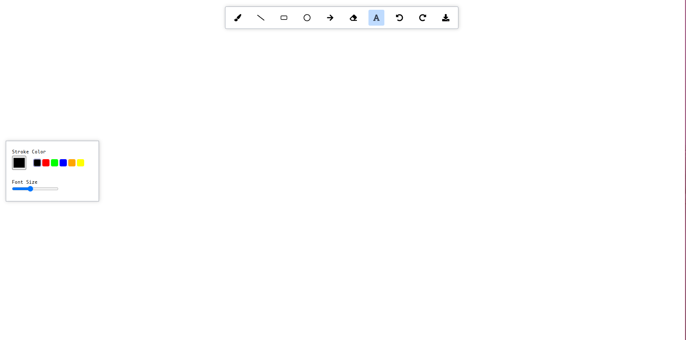
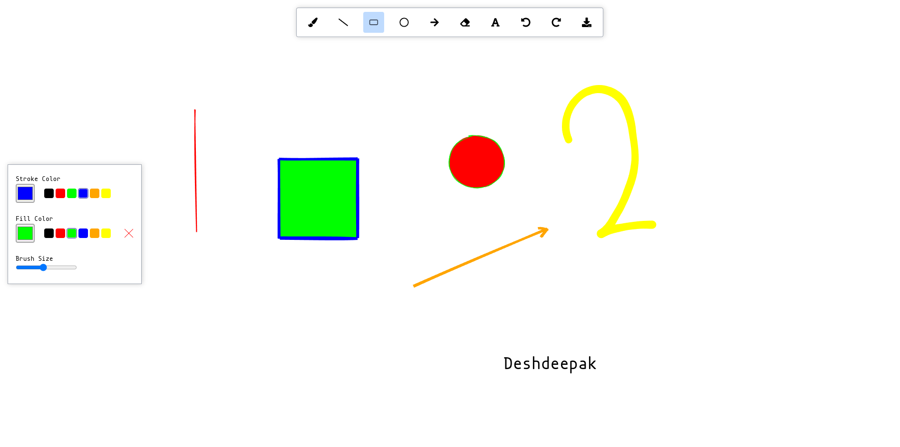

# Whiteboard App

- A fully featured whiteboard app created using react.
- Utilises HTML canvas draw different shapes on the page.
- Utilises roughjs library to give a handwriting like look.
- Utilises perfect-freehand library to enable brush tool.

## Features

### Tools
- Line
- Rectangle
- Circle / Ellipse
- Arrow
- Brush
- Eraser
- Text

### Extra Tools
- Undo
- Redo
- Download

### Extra Features
- Per tool stroke , fill color
- Per tool brush size

## Images

